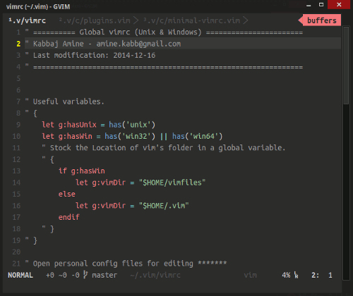

# MyVimFiles


This repo contains the vimrc that I've done and still doing with *love* for more than 2 years now, and also some other vim folders.



This configuration is personal, so you should remove some things to make it work great for you. It works on both GNU/Linux and Windows (But may be better in GNU/Linux).

## Requirements

1. [Exuberant ctags](http://ctags.sourceforge.net/) for *tagbar* plugin.

2. Linters for *syntastic* plugin:
	- c          ->  **gcc**
	- java       ->  **javac**
	- php        ->  **php**
	- python     ->  **python**
	- sh         ->  **sh**
	- javascript ->  **jslint**    ->  `npm install -g jslint`
	- html       ->  **w3**
	- css        ->  **csslint**   ->  `npm install -g csslint`
	- sass       ->  **sass**      ->  `gem install sass`
	- scss       ->  **scss-lint** ->  `gem install scss-lint`

3. This is optional, but there are some filetype specific plugins in `~/.vim/ftplugin/`, please  check them and see if you need the following:
	- `markdown` for a html2markdown quick conversion with `<F9>`.
	- `g++` for a quick C++ file compilation file with `<F9>`.
	- `Evince` in GNU/Linux to open generated pdf from Tex file compilation with `<C-F9>`.

## Usage

Clone the repo in your personal folder and be sure to have all requirements.

```
git clone https://github.com/KabbAmine/myVimFiles ~/
```

You'll need some folders so better to create them manually in your vim directory.

```
# In Unix
mkdir -pv ~/.vim/various/view ~/.vim/various/swap_dir ~/.vim/various/undodir
```

Create a symbolic link of the `vimrc`(Or a simple shortcut in Windows):
```
ln -s ~/.vim/vimrc ~/.vimrc
```

Open vim and upgrade `vim-plug` with `:PlugUpgrade`, then install all the plugins with `:PlugInstall`.

Your vim is now ready.

## Notes

Even if this configuration is quite personal, you can use most of it because the files are well documented. Also, take your time to learn mappings and commands (Toggle *tagbar* in `~/.vim/config/minimal-vimrc.vim` or `~/.vim/config/plugins.vim`).

I'm not a vim master, but my configuration works great for me so feel free to use it, improve it, love it or hate it... The choice is yours :sunglasses:.
