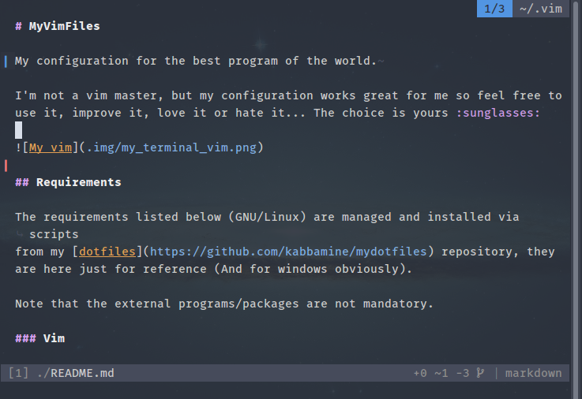

# MyVimFiles

My configuration for the best program of the world.

I'm not a vim master, but my configuration works great for me so feel free to
use it, improve it, love it or hate it... The choice is yours :sunglasses:



It works on both GNU/Linux and Windows (The `>old` versions were not tested on
windows).

## Requirements

The requirements listed below (GNU/Linux) are managed and installed via scripts
from my [dotfiles](https://github.com/kabbamine/mydotfiles) repository, they
are here just for reference (And for windows obviously).

Note that the external programs/packages are not mandatory.

### Vim

To make use of all the features you need a relatively new version of vim which supports `+job` and `+timers`, and compiled with `+python3` and `+ruby`.

### Font(s)

The fonts are from [nerd-fonts](https://github.com/ryanoasis/nerd-fonts) repo
and are included in the configuration here.

- 'FuraMono NF Medium' for GNU/Linux.
- 'InconsolataForPowerline NF Medium' for Windows.

### Formatters & fixers

| Filetype(s)                       | formatter                                   |
| :-------------------------------- | :------------------------------------------ |
| `css`, `markdown`, `scss`, `yaml` | `prettier`<sup>N</sup>                      |
| `html`                            | `js-beautify`<sup>N</sup>                   |
| `javascript`                      | `standard`<sup>N</sup>                      |
| `json`                            | `fixjson`<sup>N</sup>                       |
| `python`                          | `isort`<sup>P</sup>, `autopep8`<sup>P</sup> |
| `sh/bash`                         | [`shfmt`](https://github.com/mvdan/sh)      |

### Linters

| filetype     | linter                                               |
| :----------- | :--------------------------------------------------- |
| `c`          | `gcc`<sup>B</sup>                                    |
| `coffee`     | `coffe-script`<sup>N</sup>, `coffeelint`<sup>N</sup> |
| `css`        | `csslint`<sup>N</sup>                                |
| `html`       | `HTMLHint`<sup>N</sup>                               |
| `javascript` | `standard`<sup>N</sup>                               |
| `json`       | `jsonlint`<sup>N</sup>                               |
| `php`        | `php`<sup>B</sup>                                    |
| `python`     | `flake8`<sup>P</sup>                                 |
| `sass/scss`  | `sass-lint`<sup>N</sup>                              |
| `sh/bash`    | `shellcheck`, `sh`<sup>B</sup>                       |
| `viml`       | `vim-vint`<sup>P</sup>                               |
| `yaml`       | `yamllint`<sup>P</sup>                               |

### Coc extensions

Install using `:CocInstall`

```
coc-snippets
coc-highlight
coc-vimlsp
coc-tsserver
coc-python
coc-phpls
coc-json
coc-html
coc-css
```

Note that `coc-python` needs `jedi`<sup>P</sup>

### Miscellaneous

- `ag`<sup>B</sup> or [`rg`](https://github.com/BurntSushi/ripgrep) for grepping and **vFinder**.
- [`composer`](https://getcomposer.org/) for **phpcd**.
- [`universal-ctags`](https://ctags.io/) for tag's generation.
- [`wmctrl`<sup>B</sup>](http://tomas.styblo.name/wmctrl/) for a lot of things.
- `yad`<sup>B</sup> or `zenity`<sup>B</sup> for **vCoolor**.

### Extra

Some npm packages that will make you developer's life easier:

- `browser-sync` for live previewing static & dynamic sites.
- `shiba` for live previewing markdown.

---

_<a id="B"><sup>B</sup></a> Present by default or easily installable on your
system._  
_<a id="N"><sup>N</sup></a> A npm package_  
_<a id="P"><sup>P</sup></a> A pip package_  
_<a id="R"><sup>R</sup></a> A ruby gem_

---

## Instructions

```sh
git clone https://github.com/KabbAmine/myVimFiles ~/.vim
mkdir -pv ~/.vim/misc/templates ~/.vim/misc/view ~/.vim/misc/swap_dir ~/.vim/misc/undodir

# Link the font if you don't have it already
ln -s "~/.vim/misc/fonts/Fura Mono Medium Nerd Font Complete Mono Windows Compatible.otf" ~/.fonts/

# Not mandatory
ln -s ~/.vim/vimrc ~/.vimrc

# Then upgrade vim-plug & install the plugins (Note that before installing
# plugins, some errors will be shown)
vim +PlugUpgrade +PlugUpdate +qall
```

Have fun :smile:

## Notes

This configuration is not a ready-to-use vim distribution, it contains a lot of
settings that may no suit everyone, so take a look, test and take what you want
:beer:.
