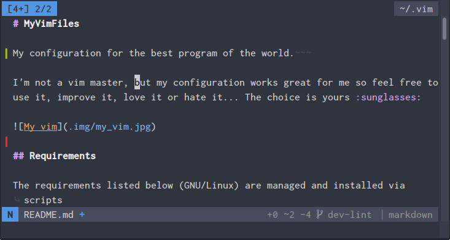

# MyVimFiles

My configuration for the best program of the world.  

I'm not a vim master, but my configuration works great for me so feel free to
use it, improve it, love it or hate it... The choice is yours :sunglasses:



It works on both GNU/Linux and Windows (The `>old` versions were not tested on
windows).

## Requirements

The requirements listed below (GNU/Linux) are managed and installed via scripts
from my [dotfiles](https://github.com/kabbamine/mydotfiles) repository, they
are here just for reference (And for windows obviously).

Note that the external programs/packages are not mandatory.

### Vim

To make use of all the features you need a relatively new version of vim which supports `+job` and `+timers`, and compiled with `+python3` and `+ruby`.

### Font(s)

- [InconsolataForPowerline NF Medium](https://github.com/ryanoasis/nerd-fonts)
  for both GNU/Linux & windows (Included in the repo).

### Formatters & fixers

| Filetype(s)                | formatter
| :------------------------- | :-------------------------
| `html`                     | `js-beautify`<sup>N</sup>
| `javascript`               | `standard`<sup>N</sup>
| `json`                     | `fixjson`<sup>N</sup>
| `python`                   | `autopep8`<sup>P</sup>
| `scss`, `css`              | `prettier`<sup>N</sup>

### Linters

| filetype                   | linter
| :------------------------- | :-------------------------
| `c`                        | `gcc`<sup>B</sup>
| `coffee`                   | `coffe-script`<sup>N</sup>, `coffeelint`<sup>N</sup>
| `css`                      | `csslint`<sup>N</sup>
| `html`                     | `HTMLHint`<sup>N</sup>
| `javascript`               | `standard`<sup>N</sup>
| `json`                     | `jsonlint`<sup>N</sup>
| `php`                      | `php`<sup>B</sup>
| `python`                   | `flake8`<sup>P</sup>
| `sass/scss`                | `sass-lint`<sup>N</sup>
| `sh/bash`                  | `shellcheck`, `sh`<sup>B</sup>
| `viml`                     | `vim-vint`<sup>P</sup>
| `yaml`                     | `yamllint`<sup>P</sup>

### Miscellaneous

- `ag`<sup>B</sup> or [`rg`](https://github.com/BurntSushi/ripgrep) for grepping and **vFinder**.
- `ctags-exuberant`<sup>B</sup> for tag's generation.
- `yad`<sup>B</sup> or `zenity`<sup>B</sup> for **vCoolor**.
- [`wmctrl`<sup>B</sup>](http://tomas.styblo.name/wmctrl/) for a lot of things.

### Extra

Some npm packages that will make you developer's life easier:

- `browser-sync` for live previewing static & dynamic sites.
- `shiba` for live previewing markdown.

-----------------------------

*<a id="B"><sup>B</sup></a> Present by default or easily installable on your
system.*  
*<a id="N"><sup>N</sup></a> A npm package*  
*<a id="P"><sup>P</sup></a> A pip package*  
*<a id="R"><sup>R</sup></a> A ruby gem*  

-----------------------------

## Instructions

```sh
git clone https://github.com/KabbAmine/myVimFiles ~/.vim
mkdir -pv ~/.vim/misc/templates ~/.vim/misc/view ~/.vim/misc/swap_dir ~/.vim/misc/undodir

# Link the font if you don't have it already
ln -s "$HOME/.vim/misc/fonts/Inconsolata for Powerline Nerd Font Complete
Windows Compatible.otf" ~/.fonts/

# Not mandatory
ln -s ~/.vim/vimrc ~/.vimrc
```

Then in Vim:

```vim
" Update vim-plug
PlugUpgrade

" Install all the plugins
PlugInstall
```

Have fun :smile:

## Notes

This configuration is not a ready-to-use vim distribution, it contains a lot of
settings that may no suit everyone, so take a look, test and take what you want
:beer:.
