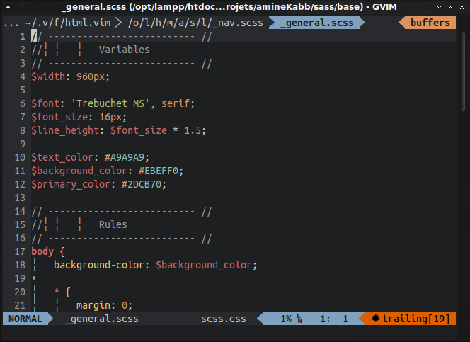

# MyVimFiles

This repo contains my vim configuration that I've done and still doing with :heart: for more than 2 years now, and some other vim folders.

It works on both GNU/Linux and Windows (But may be better in GNU/Linux).

I'm not a vim master, but my configuration works great for me so feel free to use it, improve it, love it or hate it... The choice is yours :sunglasses:.



## Requirements & external programs

1. For the plugins:
	
	- [Wmctrl](http://tomas.styblo.name/wmctrl/) for *vullscreen*.

	- [Yad](http://sourceforge.net/projects/yad-dialog/) or [Zenity*](https://wiki.gnome.org/action/show/Projects/Zenity) for *vCoolor*.

	- *Tagbar*.

		- [Exuberant ctags](http://ctags.sourceforge.net/).
		- `phpctags` (No need to install it manually, he's included with the plugin *tagbar-phpctags*).

	- *Syntastic*:

		- `gcc`*
		- `javac`*
		- `php`*
		- `python`*
		- `sh`*
		- `jslint`    ->  `npm install -g jslint`
		- [`tidy5`](https://github.com/htacg/tidy-html5)
		- `csslint`   -> `npm install -g csslint`
		- `sass`      -> `gem install sass`
		- `scss-lint` -> `gem install scss-lint`
		- `vint`      -> `pip install vim-vint`

	- *Autoformat*:
		
		- For `html`, `css` & `javascript` -> `npm install -g js-beautify`.
		- `scss` uses `sass-convert` which is shipped with `sass`.
	
	- *vim-livedown*

		- `npm -g livedown`

2. For `~/.vim/ftplugin/` files (optional):
	- `markdown`*
	- `g++`*
	- `Evince`* in GNU/Linux to open generated pdf from Tex file compilation.

\* *Present by default, or easily installable in your distribution.*

3. Fonts:

	- ['DejaVu Sans Mono for Powerline'](https://github.com/powerline/fonts) in Windows.
	- [Ubuntu Mono derivative Powerline Plus Nerd File Types'](https://github.com/ryanoasis/nerd-filetype-glyphs-fonts-patcher) in GNU/Linux.

## Instructions

```
git clone https://github.com/KabbAmine/myVimFiles ~/.vim
mkdir -pv ~/.vim/various/view ~/.vim/various/swap_dir ~/.vim/various/undodir
ln -s ~/.vim/vimrc ~/.vimrc		# Not required
```

Then in Vim:

```
:PU		# Upgrade vim-plug
:PI		# Install all the plugins
```
Have fun :smile:

## Notes

This configuration is a little personal (Commands & mappings) but well documented, so you can use most of it by changing a few things, just take a look on the files before using them.
